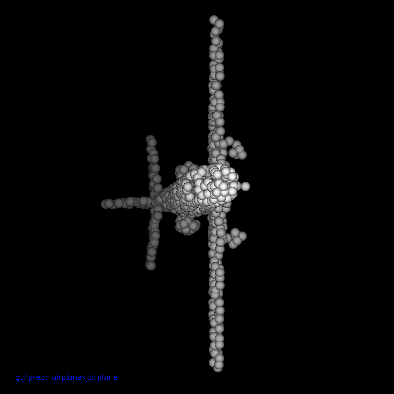
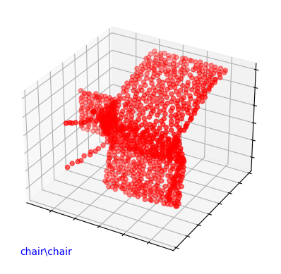

# 2022-PCT-Lightning
This is a Pytorch Lightning implementation of PCT: Point Cloud Transformer.

Paper link: https://arxiv.org/pdf/2012.09688.pdf


## Welcome Any Pull Requests!:sparkles::sparkles::sparkles:

This repo is about Classification of Point Cloud.

Any kinds of PR are highly welcome! Here are just some possible ways for you to have a try. Let me know if you have any questions/ideas! 

Possible PRs:
- Better Visualization! :bulb:(Plz help getting more refreshing images!)
  - Hint: The related codes are in `/src/utils/show3d_balls.py`. Check `/src/models/pct_modules line 120` to see how the related function be called.
- Clever Github Actions:bulb:
  - Current Action will download the whole dataset, which waste time.
- Any other PRs


### Requirements

This repo is tested with:

#### Software
Ubuntu 20.04 LTS

CUDA 11.6

python 3.9

cudatoolkit 11.3.1

pytorch 1.11.0

pytorch-lightning 1.6.3

#### Hardware
Intel i7-12700

Nvidia GTX 1080

### Install

1. Create a conda environment for this repo.
```shell script
conda create -n pct_lightning python=3.9

conda activate pct_lightning
```

2. Install the requirments.txt
```shell script
pip install -r requirements.txt
```

3. Run the quick test
```shell
python quick_test.py
```

Pre-trained model will be automatically downloaded under `{Repo_dir}/data/`.

Due to the hardware limitation, the pre-trained model has accuracy of 83.8% on the [ModelNet40](http://modelnet.cs.princeton.edu/) validation dataset.

4. Download dataset 

Download `model.ckpt` from [Google Drive](https://drive.google.com/drive/folders/1nJCQBvBV0Xz9AZUYzQ0CvY0lSHdK1uVw?usp=sharing), put it under `{Repo_dir}/data/`.

  
If you want to put `model.ckpt` to somewhere else, please remember to modify `configs/test.yaml` line 32 'ckpt_path' to `your/path/to/model.ckpt`


### Test with Visualization

**Configuring**

Open `./configs/model/pct.yaml`. Set `visual_pc` to `true`. Set `visual_path` to the path you want the output image to save. (Thousands of images).

Example:
```
visual_pc: true
visual_path: "/home/usr/code/2022-PCT-Lightning/vis_output"
```

Then, there are 2 methods you can use to get images of point cloud:


**Method 1**

1. Install cv2

```shell script
pip install opencv-python
```

2. Compile
```shell script

cd src/utils

g++ -std=c++11 render_balls_so.cpp -o render_balls_so.so -shared -fPIC -O2 -D_GLIBCXX_USE_CXX11_ABI=0

```

3. Run
```shell script
python test.py
```

Result:



**Method 1** (better if segmentation is included)

1. Install matplotlib

```shell script
pip install matplotlib
```

2. Configure

Open `./src/models/pct_module.py`. Set `plot_method = 2` in line 157.

3. Run

```shell script
python test.py
```

Result:



### Train

```shell script
python train.py
```

You can change the training parameters in `./configs/train.yaml`

### Acknowledgment

Please cite this paper if you found this repo useful for your research.
```latex
@misc{guo2020pct,
      title={PCT: Point Cloud Transformer}, 
      author={Meng-Hao Guo and Jun-Xiong Cai and Zheng-Ning Liu and Tai-Jiang Mu and Ralph R. Martin and Shi-Min Hu},
      year={2020},
      eprint={2012.09688},
      archivePrefix={arXiv},
      primaryClass={cs.CV}
}
```

This repo borrows tons of codes from [PCT_Pytorch](https://github.com/Strawberry-Eat-Mango/PCT_Pytorch)

The visualzation tool comes from [Shape2Motion](https://github.com/wangxiaogang866/Shape2Motion)

This repo uses this great template [lightning-hydra-template](https://github.com/ashleve/lightning-hydra-template)
